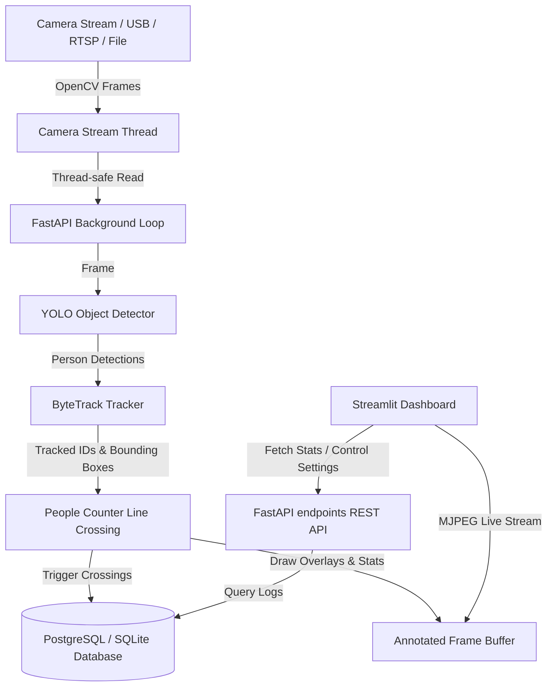

# 👁️ PeopleVision AI

PeopleVision AI is a production-ready, real-time, AI-powered people counting and tracking system using computer vision. It detects individuals, assigns persistent tracking IDs, and monitors virtual line crossings to count entries and exits.

The system features a **FastAPI REST API** backend running the real-time processing loop, a **Streamlit Dashboard** frontend for live feed visualization and database analytics, and **PostgreSQL** database storage, containerized with **Docker** and ****Docker Compose**.

---

### 💡 Inspiration & Journey (Origin Story)
> *"I watched a video on X (Twitter) showing an AI/ML model counting potatoes on a conveyor belt, and I thought—why not build something similar for tracking and counting people? I researched the best tools, and in **less than 6 hours**, I built this entire project from scratch using vibe coding (assisted by Antigravity AI). I'm excited to share this with the community! Check it out, try it locally, and show your support! 🚀"*

---

## Application

<p align="center">
  
</p>

## Prediction Result

<p align="center">
  
</p>



---

## ✨ Features

- **Robust Video Capture:** Thread-safe reader supporting USB cameras, RTSP streams, and static video files.
- **AI Detection:** Powered by Ultralytics YOLOv8/v11 configured to detect the `person` class exclusively.
- **Persistent Tracking:** Integrates Supervision's `ByteTrack` matching to assign persistent IDs to people.
- **Line Crossing Analytics:** Precise boundary crossings (entry/exit) using relative line coordinate thresholds.
- **REST API Endpoints:** Clean endpoints for health checks, count stats, config changes, and resets.
- **Live Stream Service:** Serves an MJPEG video stream direct from the background thread.
- **Interactive Dashboard:** Premium UI to monitor cameras, customize YOLO thresholds, track trends, and export CSVs.
- **Containerized Orchestration:** Production deployment setup using Docker Compose.

---

## 🛠️ Tech Stack

- **Backend Framework:** FastAPI, Uvicorn
- **Database ORM:** SQLAlchemy (PostgreSQL / SQLite)
- **Computer Vision:** OpenCV, Ultralytics YOLO, Supervision (ByteTrack & LineZone)
- **Frontend Dashboard:** Streamlit, Pandas
- **Containerization:** Docker, Docker Compose
- **Testing:** Pytest

---

## 🚀 Getting Started (Locally)

### Prerequisites
- Python 3.11+
- Git

### 1. Clone the Repository
```bash
git clone https://github.com/vaibhavkatex/peoplevision-ai.git
cd peoplevision-ai
```

### 2. Create and Activate Virtual Environment
```bash
python -m venv venv
# On Windows:
venv\Scripts\activate
# On Linux/macOS:
source venv/bin/activate
```

### 3. Install Dependencies
```bash
pip install --upgrade pip
pip install -r requirements.txt
```

### 4. Configure Environment
Copy the example environment configuration:
```bash
copy .env.example .env   # Windows
# or
cp .env.example .env     # Linux/macOS
```

By default, `.env` is configured to use **SQLite** (`sqlite:///./peoplevision.db`) for zero-setup execution, and USB camera `0` (webcam).

### 5. Run the Backend API
```bash
uvicorn app.main:app --reload
```
The API is available at `http://localhost:8000`. You can inspect the interactive Swagger docs at `http://localhost:8000/docs`.

### 6. Run the Dashboard
In a separate terminal (with virtual environment active):
```bash
streamlit run dashboard/streamlit_app.py
```
The Streamlit dashboard will launch at `http://localhost:8501`.

---

## 🐳 Docker Deployment (PostgreSQL + API + Dashboard)

Docker Compose coordinates a full production stack, launching **PostgreSQL**, the **FastAPI Backend**, and the **Streamlit Dashboard**.

### USB Webcam Limitation on Windows/macOS
> [!WARNING]
> Docker Desktop on Windows/macOS does not natively support USB device passthrough (e.g. `/dev/video0`). 
> To test the system in Docker, place a test video file (like `test_video.mp4`) in the `data/` directory and update the `.env` settings to use the video file. The system will loop the video indefinitely to simulate a camera feed.

1. Create a `data/` folder in the root directory (if not present) and copy your test video file:
   `data/test_video.mp4`
2. Configure `.env` for Docker testing:
   ```env
   DATABASE_URL=postgresql://postgres:postgres@db:5432/peoplevision
   CAMERA_SOURCE=data/test_video.mp4
   IS_VIDEO_FILE=true
   ```
3. Run Docker Compose:
   ```bash
   docker-compose up --build
   ```
4. Access:
   - Streamlit Dashboard: `http://localhost:8501`
   - FastAPI REST API: `http://localhost:8000`
   - Interactive Swagger API Docs: `http://localhost:8000/docs`

---

## ⚙️ Configuration (.env)

| Variable | Default Value | Description |
| :--- | :--- | :--- |
| `DATABASE_URL` | `sqlite:///./peoplevision.db` | Connection string for SQLite or PostgreSQL. |
| `CAMERA_SOURCE` | `0` | USB index (e.g., `0`), RTSP url, or local video path. |
| `IS_VIDEO_FILE` | `false` | Loops the file indefinitely if camera source is a video. |
| `YOLO_MODEL` | `yolov8n.pt` | Model variant weights to load. |
| `CONFIDENCE_THRESHOLD` | `0.4` | Keep detections above this score threshold. |
| `LINE_START_X_PCT` | `0.0` | Counting line start X (0.0 = left edge). |
| `LINE_START_Y_PCT` | `0.5` | Counting line start Y (0.5 = middle height). |
| `LINE_END_X_PCT` | `1.0` | Counting line end X (1.0 = right edge). |
| `LINE_END_Y_PCT` | `0.5` | Counting line end Y (0.5 = middle height). |

---

## 🛣️ API Documentation

### `GET /health`
Verifies the service status and checks database connection connectivity.
**Response:**
```json
{
  "status": "online",
  "timestamp": 1784534091.24,
  "database": "healthy"
}
```

### `GET /count`
Retrieves live counts, current frame occupancy, and system metrics.
**Response:**
```json
{
  "current_occupancy": 3,
  "entries": 14,
  "exits": 8,
  "fps": 28.45,
  "confidence_threshold": 0.4
}
```

### `GET /stats`
Retrieves database total counts and the recent 50 crossing logs.
**Response:**
```json
{
  "total_entries": 14,
  "total_exits": 8,
  "history": [
    {
      "id": 22,
      "timestamp": "2026-07-19T15:32:00Z",
      "direction": "entry",
      "tracker_id": 42,
      "camera_id": "camera_0"
    }
  ]
}
```

### `POST /config`
Updates the detection confidence threshold at runtime.
**Body:**
```json
{
  "confidence_threshold": 0.55
}
```

### `POST /reset`
Resets local counters and optionally drops database entries.
**Parameters:**
- `clear_db` (boolean, default=false)
**Response:**
```json
{
  "status": "success",
  "message": "System counts and trackers reset successfully."
}
```

### `GET /video_feed`
MJPEG live stream boundary feed. Excellent for viewing the annotated vision pipeline in Streamlit or direct browser tabs.

---

## 🧪 Running Unit Tests

Unit tests are written with `pytest` and mock external camera streams and YOLO weights downloads, allowing them to run offline and in CI/CD runners.

To run tests:
```bash
pytest tests/
```

To run with verbose output:
```bash
pytest -v
```

---

## 🖼️ Screenshots Placeholders

### Streamlit Live Dashboard Mockup

*(Displays live video stream, key metric cards, config slider, and historic charts of cumulative entries/exits)*

### Swagger API Schema Docs


---

## 🗺️ Future Roadmap

1. **Multi-Camera Orchestration:** Aggregate multiple feeds and line counters into a unified monitoring system.
2. **GPU-Accelerated Docker Base:** Provide custom `CUDA`-enabled docker configurations for server environments.
3. **Advanced Region Analytics:** Zone occupancy heatmaps (detecting dwell times and crowd clusters).
4. **Outbound Webhook Alerts:** Broadcast line crossing logs directly to external endpoints (e.g. Slack, custom webhooks).
5. **Masking Regions:** Configure static polygon exclusion zones to ignore background movement (e.g., TVs or traffic windows).

---

## 📄 License

Distributed under the MIT License. See [LICENSE](file:///c:/Users/sdf/Desktop/peoplevision-ai/LICENSE) for details.
